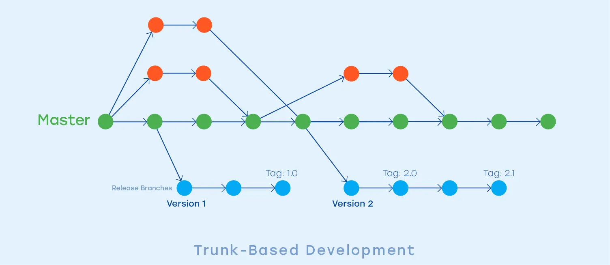
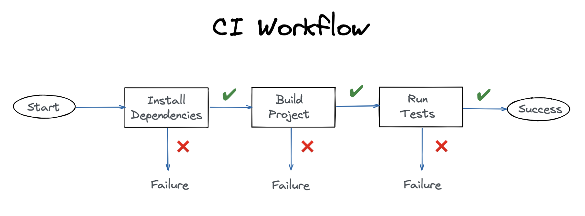
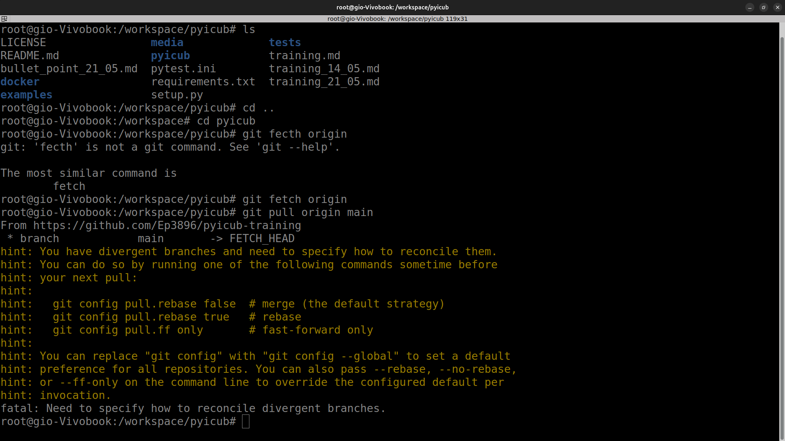

# Pyicub Team Development Meeting: CI and Recap of What We Have Achieved So Far

## **Structure of the Meeting**:

1. **Theoretical Part**:   
   1.1 Quick recap
   
   1.2 CI workflow 

2. **Practical Part**: 

   2.1 CI in action!

This **won't** be a practical and interactive session, so please enjoy your coffee! :)

--- 


### Quick Recap

1. **Branching Strategy**

    We follow a trunk-based development model, where <strong>master</strong> is the main production branch:

    <div style="text-align: center;">
        
        <p></p>
    </div>

    All new work is done in short-lived branches derived from master, using clear naming conventions:

    | Branch Name | Protected? | Base Branch | Description                                                                |
    | ----------- | ---------- | ----------- | -------------------------------------------------------------------------- |
    | `master`    | YES        | N/A         | The main production branch. All stable code lives here.                    |
    | `feature/*` | NO         | `master`    | Short-lived branches for new features. Merged into `master` when ready.    |
    | `bugfix/*`  | NO         | `master`    | Short-lived branches for small fixes. Merged into `master`.                |
    | `v1.x`      | YES        | `master`    | Long-term release branches for major or divergent versions of the library. |

    This strategy keeps the main branch stable and simplifies integration.

    Each branch is isolated, focused on a single task, and deleted after being merged to keep the repository clean.

--- 

1. **Pull Request Workflow**

    Every contribution is integrated through a pull request (PR) to master.

    As we have discussed in the previous meeting, it is important tthat the person that makes a contribution opens the PR related to it.

    The standard process includes:

        - Creating a feature or bugfix branch

        - Writing meaningful commit messages (ideally following the Conventional Commits spec)

        - Opening a PR with a clear description and test status

        - Assigning a reviewer and addressing feedback

    Even if GitHub Actions is not used, the PR is treated as a formal checkpoint:

        - Developers are expected to run tests locally before submitting

        - A shared PR template ensures consistency, traceability, and code quality

---

3. **Development Environment**

    - The project uses a Docker-based environment to isolate dependencies and ensure consistency across machines.

    - All development and testing is performed inside the container, which includes the full YARP and Pyicub stack.

    - The container runs as root to simplify access to simulation tools, device interfaces, and YARP ports.

    - This setup guarantees that all contributors work in the same environment, avoiding configuration drift and system-specific issues.

    - Testing and automation scripts (e.g., runTests.sh) are integrated directly into the container and executed as part of the local CI process.

---

### CI workflow 

1. **Introduction**

    Continuous Integration (CI) is a development practice that automates the testing and validation of code before it's merged into a shared repository.

    It helps teams detect issues early, maintain code quality, and streamline collaboration.

    In this presentation, we review what CI is, how we've applied it to our project, and how it is implemented in our PyiCub workflow.

---
2. **Standard CI Workflow**

    A typical CI pipeline is triggered on every code change, often via a pull request to a main branch.

    <div style="text-align: center;">
        
        <p>Diagram of the CI workflow: automating dependency installation, testing, and code quality checks to ensure only validated code is merged.</p>
    </div>

    The pipeline automatically:

    1) Installs dependencies  
    2) Runs tests  
    3) Enforces coding standards  

    If the pipeline passes, the code is considered safe to merge.

    This process ensures that all contributions are validated in a consistent, isolated environment, reducing integration errors and improving software reliability.

    Tools like GitHub Actions, GitLab CI, and Jenkins are commonly used to implement this model in cloud-hosted environments. Additionally, self-hosted machines can be configured to run CI pipelines, offering greater control over the environment and enabling the use of specialized hardware or software dependencies that may not be available in cloud-based solutions.

---

4. **Limitations in Our Context**

    Despite following best practices for containerization, I was unable (for now) to use cloud-based CI systems like GitHub Actions.

    This limitation stems from YARP’s reliance on system-level features such as real-time communication, network services, and device access, which are typically restricted or unavailable in hosted CI environments.

    As a result, I opted for a local CI workflow, leveraging Docker and Git hooks to enforce testing before code integration.

---

5. **Our CI Approach**

    I implemented a local Continuous Integration strategy tailored to our constraints.

    All development occurs inside a Docker container, ensuring a consistent environment across contributors.

    A Git pre-push hook runs the test suite automatically before any code is pushed to the repository.

    This guarantees that only tested code reaches the remote repository, enforcing quality without relying on cloud-based CI platforms.

    The test logic is centralized in a script (scripts/test.sh), making the process reproducible and easy to maintain.

---

6. **What We’ve Achieved So Far**

    - Established a consistent and reproducible development environment using Docker.

    - Automated the execution of tests through a pre-push Git hook, ensuring code is verified before integration.

    - Enabled team-wide alignment on testing practices without relying on external CI infrastructure.

    - Reduced integration issues by enforcing local validation before any contribution reaches the shared repository.
  


------------


## Practical Part: CI Contribution Workflow

This guide walks through the standard CI workflow for contributing to the `pyicub` project using a Dockerized development environment. It includes Git conflict resolution strategies and possible outcomes when synchronizing your branch with the main repository.

---

### 1. Start the Docker Development Container

1. Clone the repository and navigate to the Docker directory:

   ```bash
   git clone https://github.com/Ep3896/pyicub-training.git
   cd pyicub-training/docker
   ```

2. Launch the container:

   ```bash
   bash go
   ```

   This file builds and launches the backend and frontend service.
   It opens `terminator` and enters the workspace at:

   ```
   /workspace/pyicub
   ```

---

### 2. Open the Workspace in VS Code

1. Launch Visual Studio Code in the host machine.
2. Open the command palette (`Ctrl+Shift+P`) and run:

   ```
   Dev Containers: Attach to Running Container
   ```
3. Select the appropriate container from the list.

---

### 3. Pull the Latest Changes from `main`

To ensure your branch is up-to-date:

```bash
git fetch origin
git pull origin main
```

---

### 4. Create a Feature or Bugfix Branch

Use a meaningful name:

```bash
git checkout -b feature/improve-logging
```

---

### 5. Make Your Contribution

* Work inside the container.
* Follow best practices for modularity, documentation, and clean code.

---

### 6. Run Tests Locally

```bash
bash /workspace/scripts/runTests.sh
```
or 

```bash
cd /workpace/pyicub/scripts
pytest -v
```

Ensure:

* Tests pass.
* No regressions are introduced.

---

### 7. Commit Changes

Follow Conventional Commits:

```bash
git add .
git commit -m "feat(logging): improve output format for error logs"
```

---

### 8. Push Your Branch

```bash
git push origin feature/improve-logging
```

> [!IMPORTANT]
> The pre-push Git hook will run `scripts/runTests.sh`. If tests fail, the push will be blocked.


Problem with pushing becuase Github Credential Manager does not open?
Please prompt the following command to solve this issue:

```bash
#configure git credentials
git-credential-manager configure 
git config --global credential.credentialStore plaintext
```

---

### 8.5. Test the Merged State Locally (Pre-PR Validation)

To ensure that your feature branch integrates cleanly with the latest version of `main`, perform a local merge and re-run the test suite:

```bash
# Fetch the latest main
git fetch origin

# Create a temporary merge branch
git checkout -b temp/merge-test
git merge origin/main
git merge feature/improve-logging
```

If there are any conflicts, resolve them using VS Code or the terminal (To troubleshoot this problem, please refer to [Appendix: Git Conflict Outcomes](#appendix-git-conflict-outcomes)). Once resolved:

```bash
# Run the test suite
bash /workspace/scripts/runTests.sh
```

If tests pass:
- You can safely proceed to open the pull request.
- Optionally delete the temp branch:
  ```bash
  git checkout feature/improve-logging
  git branch -D temp/merge-test
  ```

If tests fail:
- Fix the issue in your feature branch.
- Repeat this merge test until the integration works cleanly.

> This step simulates what a centralized CI pipeline would validate automatically — and helps maintain a clean and stable `main`.


### 9. Open a Pull Request (PR)

* Fill in the PR template:

  * Summary of the changes.
  * Test logs.
  * Affected components.
* Assign reviewers.
* Discuss and address comments.


```markdown
## Summary

<!-- Briefly explain what this PR does and why it is needed -->

Fixes #[issue_number]

## Changes

- [ ] Implemented feature / fix description
- [ ] Added/modified tests
- [ ] Updated documentation or usage examples (if applicable)

---

## Change Manager: Verified that:

- [ ] **Solution is implemented**

  - [ ] Code compiles and all tests pass  
    Details:  
    ```
    pytest output / build logs / manual test results
    ```

  - [ ] Behavior matches expected results  
    Details:  
    ```
    Description of output, validation steps or test plan
    ```

- [ ] **Implementation is documented**
  - [ ] Docstrings and usage updated (if needed)
  - [ ] Changelog entry added
  - [ ] Commit messages are clear
  - [ ] Version bump considered  
    Details:  
    ```
    Not needed / Patch / Minor / Major - and why
    ```

> Note: this template will most likely implemented as a pull request template in GitHub, as a future improvement.
---

## Checklist

- [ ] Code conforms to PEP8 / project style guidelines
- [ ] No commented-out debug code or print statements
- [ ] No large files or data included by mistake (keys etc..)
```


---

### 10. Merge & Clean Up

* Once approved, the maintainer merges the PR.
* Branch is deleted post-merge to keep the repo clean.

---

## Appendix: Git Conflict Outcomes

#### If You Encounter Conflicts:

Git may return:

```
hint: You have divergent branches and need to specify how to reconcile them.
hint: You can do so by running one of the following commands sometime before
hint: your next pull:
hint: 
hint:   git config pull.rebase false  # merge (the default strategy)
hint:   git config pull.rebase true   # rebase
hint:   git config pull.ff only       # fast-forward only
hint: 
hint: You can replace "git config" with "git config --global" to set a default
hint: preference for all repositories. You can also pass --rebase, --no-rebase,
hint: or --ff-only on the command line to override the configured default per
hint: invocation.
```


<div style="text-align: center;">
    
    <p>Git Conflict Resolution Example</p>
</div>


You have several options:

---

#### Option 1: Merge Strategy (Default)

```bash
git config pull.rebase false
git pull origin main
```

* Git will attempt a **merge**.
* If there are conflicts:

  * VS Code will highlight them.
  * Use **"Accept Incoming/Current/Both Changes"** to resolve.
  * After resolving:

    ```bash
    git add .
    git commit -m "Resolve merge conflicts"
    git push
    ```

---

#### Option 2: Rebase Strategy (Clean History)

```bash
git config pull.rebase true
git pull --rebase origin main
```

* Your commits will replay on top of the updated main.
* Resolve conflicts similarly and continue the rebase:

  ```bash
  git rebase --continue
  ```
* This keeps history linear, avoiding merge commits.

---

#### Option 3: Abort Changes (if unsure)

```bash
git merge --abort
# or
git rebase --abort
```

* This returns you to the previous safe state.
